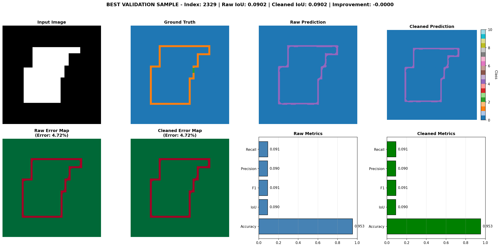

# Mathias Villerabel — AI Engineer

Production ML for time-series, IoT, and large-scale data pipelines.

- **10⁹+ records/batch** — PySpark pipelines at Swiss Re
- **12% forecast lift** — demand prediction at Pernod Ricard
- **< 2h reconciliation** — automated from multi-day manual reviews
- **Real-time IoT ML** — sensor-to-model pipelines at Equans

<a href="./assets/pdf/cv_villerabel_mathias_2025_eng.pdf" class="cv-download-btn">Download CV (PDF)</a>
<a href="mailto:m.villerabel@gmail.com" class="cv-download-btn">Email me</a>

---

I build machine learning systems that ship. Currently at Equans, I own the full pipeline from IoT sensors to production ML — Azure IoT Hub, Kafka, Spark/Polars for distributed feature engineering, model serving and monitoring on Palantir Foundry. Previously built billion-record pipelines and IFRS 17 simulation engines at Swiss Re, and custom PyTorch forecasting frameworks at Pernod Ricard. Before that, 3 years of applied research in Tokyo (SAR/computer vision, published in IEEE Access, 2nd Prize at NEDO Challenge).

---

## Featured Projects

### [Time Series Forecasting at Scale](./projects.html#project1)

> **Stack**: PyTorch, Hydra, MLflow, Optuna, FastAPI, Docker, Streamlit | **Result**: 7.1% MAPE on Walmart M5 (28-day horizon, walk-forward validation) | [Repo](https://github.com/MrEleden/forecasting_demo) &#124; [Demo](https://forecastingdemo-jgkrsrcxen3wzvjcappbgra.streamlit.app/) *(~30s cold start)*

Production-grade forecasting with 10+ model architectures across retail, rideshare, and inventory domains. Config-driven experiments, tracked runs, Bayesian HPO, containerized serving.

### [Movie Recommendation System](./projects.html#project2)

> **Stack**: PyTorch, Hydra, MLflow, Optuna, Gradio, Streamlit | **Result**: RMSE ~0.323 on MovieLens (100K+ ratings) | [Repo](https://github.com/MrEleden/reco_app) &#124; [Demo](https://huggingface.co/spaces/MrEleden/movie-reco-demo) *(~30s cold start)*

End-to-end recommendation system — 4 architectures, full ML lifecycle from training to global inference API on Hugging Face Spaces.

### [Floorplan Wall Segmentation](./projects.html#project3)

> **Stack**: PyTorch, DeepLabV3, OpenCV, Hydra, ONNX | **Result**: 99.4% pixel accuracy (wall-class F1 significantly above baseline despite 96/4 class split) | [Repo](https://github.com/MrEleden/computer_vision_2d_to_3d)

Computer vision for architectural floorplan segmentation — handling extreme class imbalance with class weighting, morphological postprocessing, and ONNX export. 50ms inference.

[View All Projects →](./projects.html)

---

## Experience

### AI Engineer — Equans | Paris | Jul. 2025 – Present
- End-to-end data pipelines: Azure IoT Hub → Kafka → Palantir Foundry streaming, batch on Spark/Polars
- Distributed feature engineering and predictive maintenance models for industrial refrigeration fleets
- Model serving and monitoring — online inference, drift detection, automated retraining

### Data Scientist — Swiss Re | Zurich | Sep. 2023 – Jun. 2025
- IFRS 17 simulation engine (cash flows, discounting, CSM) to benchmark EY outputs
- Automated reconciliation (GL ↔ actuarial models), days → < 2 hours per run
- PySpark pipelines in Palantir Foundry scaling to 10⁹+ records/batch

### Data Scientist — Pernod Ricard | Paris | Jan. 2023 – Aug. 2023
- Time-series forecasting (ARIMA, gradient boosting, custom PyTorch framework)
- 3-month demand forecasts improved by 12% vs. analyst baseline

### Research & Applied Scientist — Synspective | Tokyo | Dec. 2019 – Jan. 2023
- SAR-based construction detection, object detection for maritime trade (2nd Prize NEDO Challenge)
- Cloud-based Earth observation platform on Google Cloud

### ML Intern — National Institute of Informatics | Tokyo | 2019
- Action detection models (MobileNetV2 + LSTM) for UAV systems — published in IEEE Access

**Education**: MSc Computer Science — Sorbonne University, France

[Full details →](./about.html)

---

## Contact

- **Email**: [m.villerabel@gmail.com](mailto:m.villerabel@gmail.com)
- **LinkedIn**: [linkedin.com/in/mathias-villerabel-ba32b0146](https://www.linkedin.com/in/mathias-villerabel-ba32b0146/)
- **GitHub**: [github.com/MrEleden](https://github.com/MrEleden)
